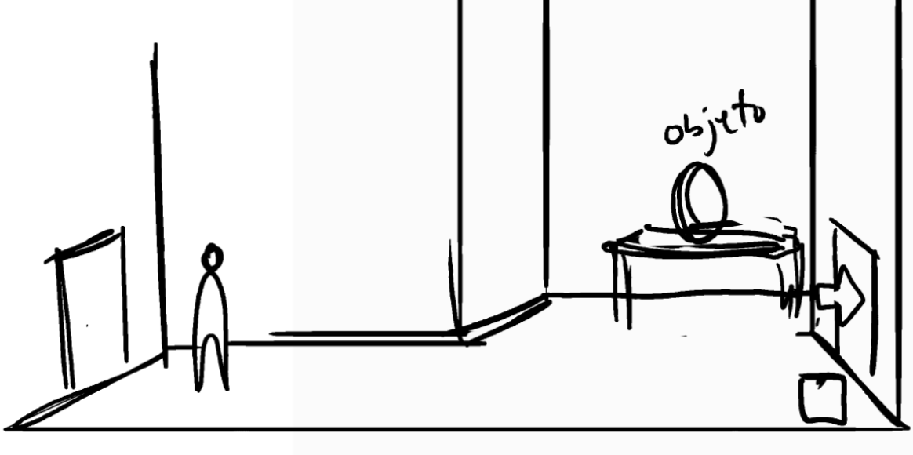

# GlobalGameJam2023

This is a game created for the Global Game Jam 2023.

# Members

- [Luis Rojas (Programmer)](https://globalgamejam.org/users/antares "https://globalgamejam.org/users/antares")
- [Sergio Lumley (Programmer)](https://globalgamejam.org/users/sergio-lumley "https://globalgamejam.org/users/sergio-lumley")
- [Oriana Laplana (GD/UX)](https://globalgamejam.org/users/oriana "https://globalgamejam.org/users/oriana")
- [Marta Alonso (Art)](https://www.instagram.com/_crimsss_/ "https://www.instagram.com/_crimsss_/")
- [Ciro Rodríguez LLorens (Audio)](https://www.instagram.com/ciro_rodriguez_ll "https://www.instagram.com/ciro_rodriguez_ll")

# Concept and initial intentions

Art: Frontal View with 2D character and environments emulating some depth.

Movement: Left/Right, get closer or further away from the camera.

Plot: There's several rooms (4) connected by lateral doors or stairs. There's a given amount of key objects (3) which have to be collected and dropped in certain locations. You may hold only one object in your hand. There's certain spots where objects can be placed. Each main object has one specific spot as a final target. There's certain interactive text elements on each room to help you figure out where objects need to be placed.

When an object is placed in a slot, a tormenting spot may spawn (either static or moving). When you come closer to a torment spot, you get audio and visual feedback of the torment. If you get too close, the character may faint (defeated). When all key objects are in place, the curse is lifted.

 - While holding an object, you may not interact with other objects, but only with reading elements or spaces where to place it.
 - When you're defeated, the character may faint and spawn again from the initial point, but progress is maintained.

# Controls
 - Left, right, up or down. ( WASD )
 - Button to interact ( E )
 - Button to read ( R )

# Game and how to play
[Try it out here](https://exantares.github.io/GlobalGameJam2023WebGL/)
