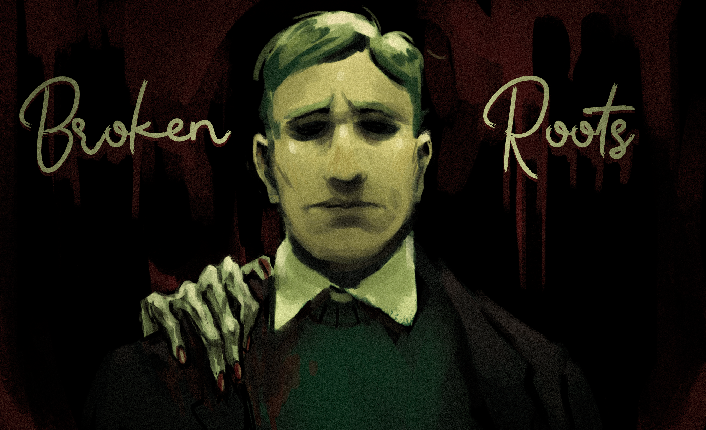
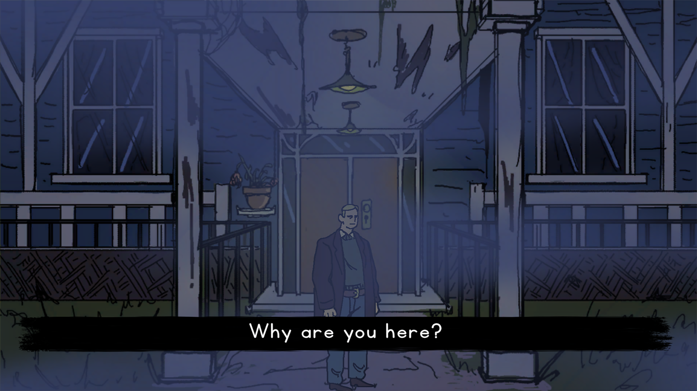
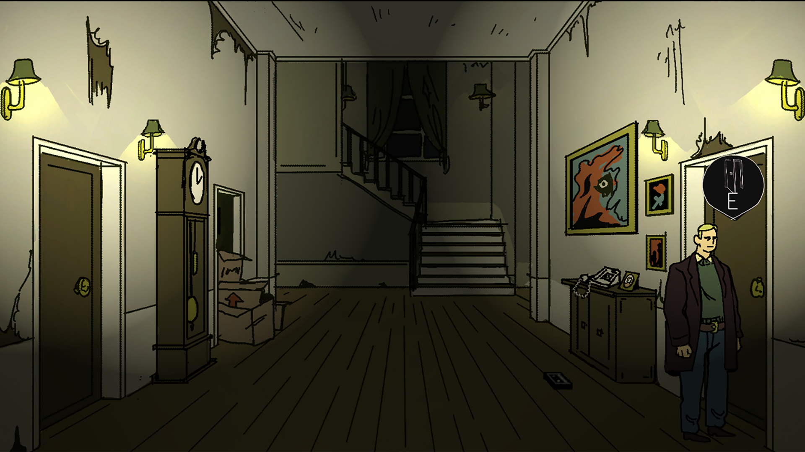
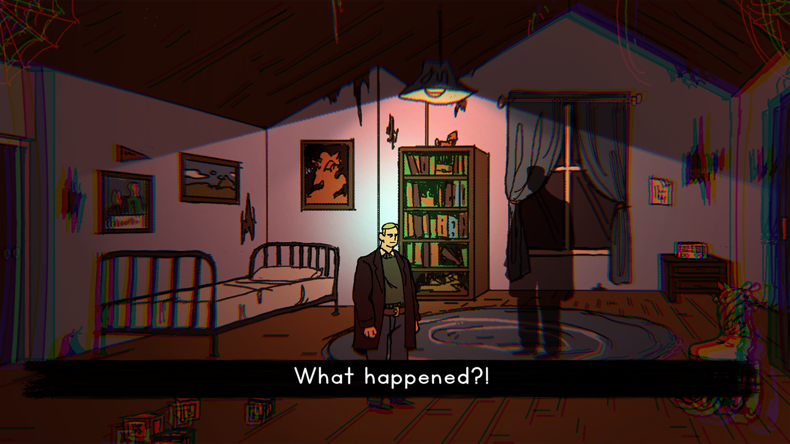

# GlobalGameJam2023

This is a 2D game created for the Global Game Jam 2023: [Broken Roots](https://globalgamejam.org/2023/games/broken-roots-1).

Enjoy this short story heavily inspired by PT (Playable Teaser).

# Play it

 - [Play it right here!](https://exantares.github.io/GlobalGameJam2023WebGL/)

 - [Version post Jam here](https://exantares.github.io/GlobalGameJam2023WebGL/UpdateOri/)

# Plot
Our protagonist has come back to a place where he thought he'd never be able to return. Some things have changed, but a lot is still troubling him. Help him search for clues and uncover his past. 

Nuestro protagonista ha vuelto a un sitio que no creía regresar nunca. Algunas cosas han cambiado, pero sigue habiendo cosas que le perturban. Ayúdalo a encontrar pistas y descubrir su pasado.

# Controls
 - Left, right, up or down. (WASD)
 - Button to interact (E)

# Members
- [Luis Rojas (Programmer)](https://globalgamejam.org/users/antares "https://globalgamejam.org/users/antares")
- [Sergio Lumley (Programmer)](https://globalgamejam.org/users/sergio-lumley "https://globalgamejam.org/users/sergio-lumley")
- [Oriana Laplana (GD/UX)](https://globalgamejam.org/users/oriana "https://globalgamejam.org/users/oriana")
- [Marta Alonso (Art)](https://www.instagram.com/_crimsss_/ "https://www.instagram.com/_crimsss_/")
- [Ciro Rodríguez LLorens (Audio)](https://www.instagram.com/ciro_rodriguez_ll "https://www.instagram.com/ciro_rodriguez_ll")